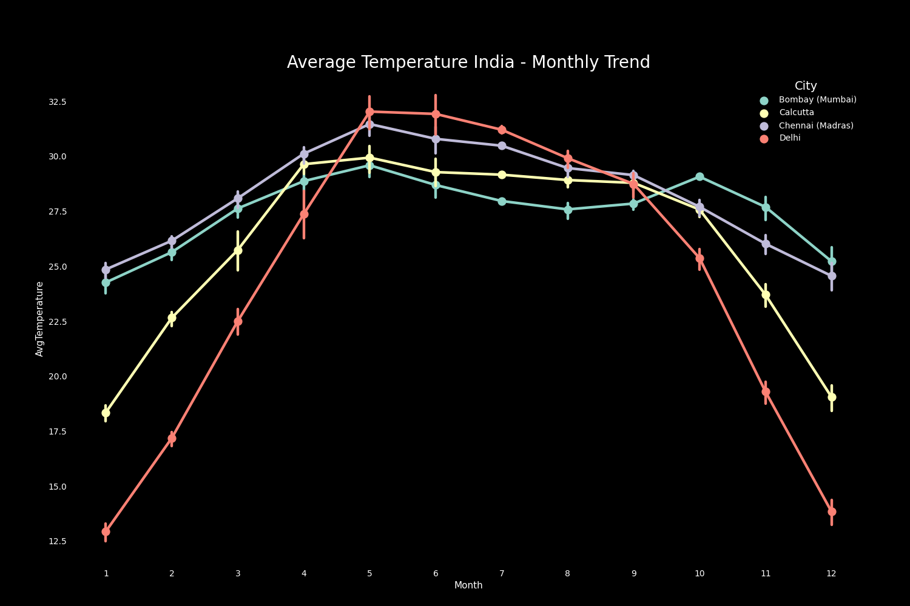

# ClimateAnalysis_EduHacks_Pushpendra

My primary aim is to delve into the intricate dynamics of climate change, examining its profound impact on temperatures, natural disasters, and the resulting economic consequences. I firmly believe that a comprehensive understanding of climate change not only equips us to confront its challenges but also paves the way for a brighter future for generations to come.

Furthermore, I am dedicated to scrutinizing the repercussions of climate change specifically within my homeland, India. Given the rapid growth of India's population, coupled with escalating urbanization and resource exploitation, it becomes imperative to grasp the implications of climate change in this context.

This endeavor serves as my contribution to social good for the EduHacks hackathon 2023. I am optimistic that this project will play a vital role in fostering awareness and concern regarding climate change, contributing to a collective effort toward sustainable and informed action.

## Content

- [Intro](#intro)
- [Global Temperature](#global-temperature)
- [CO2-Levels](#co2-levels)
- [Natural Disasters](#natural-disasters)
- [Economic Damage](#economic-damage)
- [Correlation Heatmap](#correlation-heatmap)
- [Climate Change in India](#climate-change-in-india)
- [10 Most Affected States](#10-most-affected-states-union-territories)
- [10 Least Affected States](#10-least-affected-states-union-territories)
- [Zone-wise](#zone-wise-temperature-change)
- [Seasonal Temperature Change in India](#seasonal-temperature-change)
- [Overall Trend in India](#overall-trend-of-temperature-change)
- [Climate Spiral](#climate-spiral)
- [Effect in Major Cities in India](#air-temperature-in-major-indian-cities)
- [Temperature Change Visualization WebGL Globe](#temperature-change-webgl-globe)

## Intro

Climate change is one of the major challenges of our time. This change is impacting local climates all around the world. In this project, we will examine temperature change in India and its different sub-national units. The purpose of this project is to unveil the impacts of climate change and manifest them through visualizations and analyses. Let us first learn more about climate change, its causes and its effects.

### What is climate change?

"Climate change refers to long-term shifts in temperatures and weather patterns. These shifts may be natural, such as through variations in the solar cycle. But since the 1800s, human activities have been the main driver of climate change, primarily due to burning fossil fuels like coal, oil and gas."

### What are its causes?

"The cause of current climate change is largely human activity, like burning fossil fuels, like natural gas, oil, and coal. Burning these materials releases what are called greenhouse gases into Earth’s atmosphere. There, these gases trap heat from the sun’s rays inside the atmosphere causing Earth’s average temperature to rise. This rise in the planet's temperature is called global warming. The warming of the planet impacts local and regional climates. Throughout Earth's history, climate has continually changed. When occurring naturally, this is a slow process that has taken place over hundreds and thousands of years. The human-influenced climate change that is happening now is occurring at a much faster rate."

### What are its effects?

"Global climate change has already had observable effects on the environment. Glaciers have shrunk, ice on rivers and lakes is breaking up earlier, plant and animal ranges have shifted and trees are flowering sooner. Effects that scientists had predicted in the past would result from global climate change are now occurring: loss of sea ice, accelerated sea-level rise and longer, more intense heat waves."

## Global Temperature

I calculated the mean temperature of the 1951 - 1980 period to establish the global base mean temperature. This is standard practice in climate science. In climate science, temperature anomaly represents temperature pattern accurately than absolute temperature. It is a measure of the departure from baseline temperature. Basically, it indicates how much warmer or cooler it is than the baseline. The baseline used here is the average temperature over the 30 year period 1951-1980 (base period used by NASA).

Plotting the temperature anomaly over the years, clearly indicates the warming of Earth. The warming is more pronounced from about 1920 onwards. In 2015, the Earth is 0.76 degree Celsius warmer than the normal. The result above confirms the scientific consensus that the Earth is warming.

_Source: [Berkeley Earth Dataset](https://www.kaggle.com/datasets/berkeleyearth/climate-change-earth-surface-temperature-data)_

## CO2 levels

Using the [UC San Diego Carbon Dioxide dataset](https://www.kaggle.com/datasets/ucsandiego/carbon-dioxide), I have plotted the Global Annual CO2 levels in atmosphere. We will analyze the correlation between temperature and CO2 levels later.

The CO2 levels in atmosphere have steadily risen in the 1950-2010 period, indicating a linear relation between greenhouse gases and global temperature.

On calculating, the correlation coefficient of CO2 and temperature anomaly is 0.92, confirming the linear relation between the two variables. This scatter plot visualizes the linear relation between CO2 levels and temperature anomaly.

## Natural Disasters

To understand the correlation between climate change and natural disasters, we will perform EDA analysis on [Natural Disaster Data](https://www.kaggle.com/datasets/dataenergy/natural-disaster-data)

The bar plot above with individual stacks for each disaster category shows that the occurrence of floods has significantly increased over the years relative to other disasters. The next highest increase in occurrence is that of extreme weather followed by earthquakes. The plot also shows that there has been a steady increase in the number of total natural disasters globally. This is more evident from the plot below.

The above plot indicates a positive correlation between temperature anomaly and the occurrence of natural disasters. Especially after around 1940 when it starts becoming warmer than the normal, natural disasters also start rising globally.

Let's also investigate the economic damage caused by natural disasters.

### Economic Damage

Economic damage is highly variable as it depends on several factors such as the disaster type, disaster location, severity of the disaster, disaster management efforts, etc.

However, one key trend that stands out from the plot is that the total economic damage from all the disasters is generally increasing over the years. The main reason is the increase in disaster occurrences (correlated with global temperature rise), although all disasters don't contribute equally to the economic damage. Another reason for higher economic damage could be the overall increase in economic growth which leads to more infrastructure, land use, etc.

### Correlation Heatmap

The heatmap and the correlation values confirm our analysis from the previous plots that global temperature rise has a strong positive correlation with all types of natural disaster occurrences (except mass movement (dry)) and has a relatively lower correlation with economic damage.

# Climate Change in India

A baseline period is needed to define the observed climate with which climate change information is usually combined to create a climate scenario. The IPCC Data Distribution Centre (IPCC DDC) suggests the period 1961-1990 to be used as the baseline period. This period has generally good observed data and it represents the recent climate to which many present-day human or natural systems are likely to be reasonably well adapted.

## 10 Most Affected States/Union Territories

- Lakshadweep suffered the most from temperature change in the last decade. Lakshadweep is a tropical archipelago (an extensive group of islands). Andaman and Nicobar Islands is another archipelago on the list. It is already well known that islands are more vulnerable to and threatened by the effects of climate change.
- Tamil Nadu, Kerala and Puducherry are all coastal regions in the southern part of the country. Climate change threatens coastal areas, which are already stressed by human activity, pollution, invasive species, and storms.
- Himachal Pradesh, Uttarakhand, Delhi, Chandigarh and Haryana are regions in the north of India. North India has been witnessing frequent heatwaves and high temperatures in the recent past.

## 10 Least Affected States/Union Territories

- Tripura, Mizoram, Meghalaya, Manipur and Assam form most of the North-East and are among the states which experienced the least temperature change in the country.
- West Bengal, Jharkhand, Orissa and Bihar are eastern states of India while Chhattisgarh lies in the central part.

## Zone-wise Temperature Change

- The southern zone experienced the maximum temperature change. All the states in this region touch the coastline of India. Lakshadweep and Andaman & Nicobar Islands also lie in this region. Islands and coastal regions are relatively more vulnerable to the effects of climate change.
- The northern zone is second on the list. The northern region has been witnessing frequent heatwaves and high temperatures in the recent past.
- The western and central parts witnessed temperature changes greater than 0.5 °C.
- The eastern and north-eastern states have experienced the least change in terms of temperature. The northeastern part of India is known for its diverse and most extensive lush forest cover. The India State of Forests Report (ISFR) 2021, released by the Ministry of Environment, revealed that the forest cover in the eight northeastern states accounts for 23.75% of the total forest cover of the country.

## Overall Trend of Temperature Change

- It is evident from the bar graph that the value for temperature change has continuously increased between 1901 and 2020. A positive change in temperature means that the temperature has risen.
- The maximum annual temperature change (Mean Annual Temperature Change) of 1.12 °C was witnessed in 2009, while the minimum was experienced in 1917 with a change of -0.88 °C.
- A relatively erratic increase in temperature can also be noticed in the graph in the last two decades (2001-2020).
- Hence, it can be concluded that India has seen a continuous rise in temperature between 1901-2020.

## Seasonal Temperature Change

- In the graph, the Monsoon season has a relatively smoother line with fewer fluctuations and small peaks.
- Winter, summer and post-monsoon have more fluctuant lines than monsoon.
- Winter has witnessed the most erratic changes in temperature with abruptly high peaks.
- In addition, the hottest winter with maximum temperature change was in 2009 and the summer of 2010 was the second hottest season.

### Climate Spiral

The following is a visualization that presents monthly temperature anomalies in India between 1901-2020.

[View Climate Spiral Video](images/climate_spiral.mp4)

## Air Temperature in Major Indian Cities

The plot below contains the yearly trend in the four major cities of India.

From the plot, Chennai being the hottest city (among the 4 cities in the dataset) followed by Mumbai.

Interesting insight here is that during summer Delhi shows the maximum temperature and during winter Delhi again shows minimum temperature. Since, Delhi shows both extremes which results in balance in its average temperature

## Temperature Change WebGL Globe

This is a webgl-globe created inspired by google chrome experiments used to visualize surface temperature anomalies over the past century.

- This globe shows the average temperature anomalies over land between the years of 1910 and 2019 in decades. Temperature anomalies are defined by the difference in temperature at that location between at a given period in time and the average temperature between the years of 1951 and 1980 (chosen by NASA).
- The color and height of the spikes are jointly scaled to show how much average temperature has changed from the 1951-1980 average. Blues and purples, shows temperatures cooler than the average while reds, yellows and oranges show temperatures warmer than the average.

_Data Source: [NASA GISS](https://data.giss.nasa.gov/gistemp/)_
